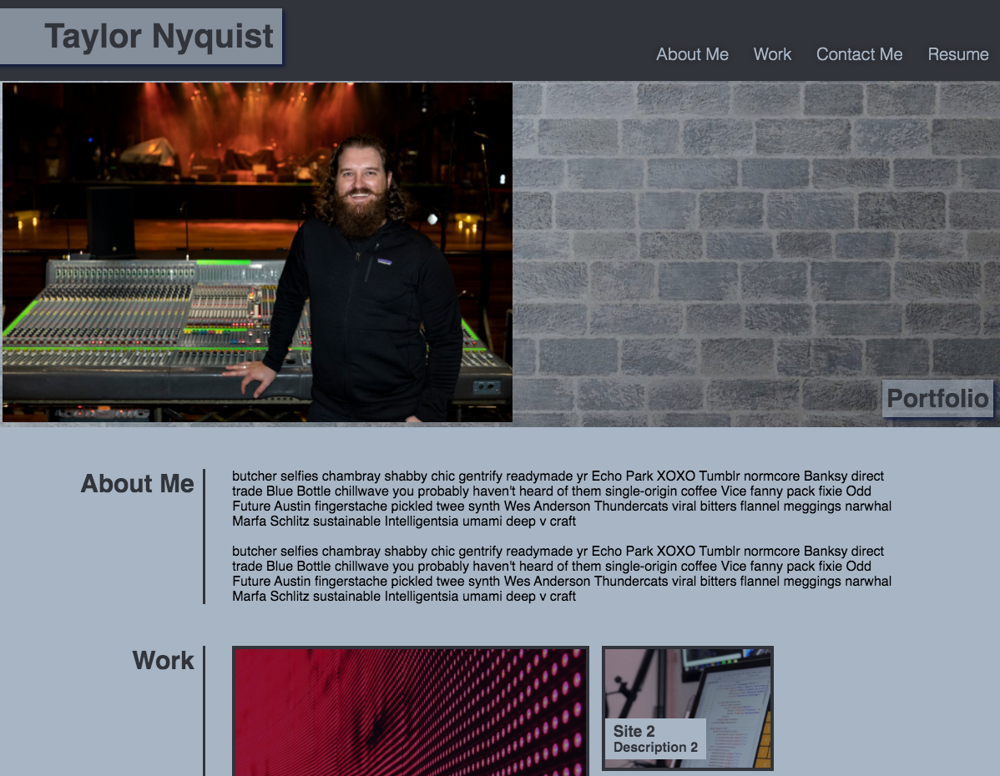
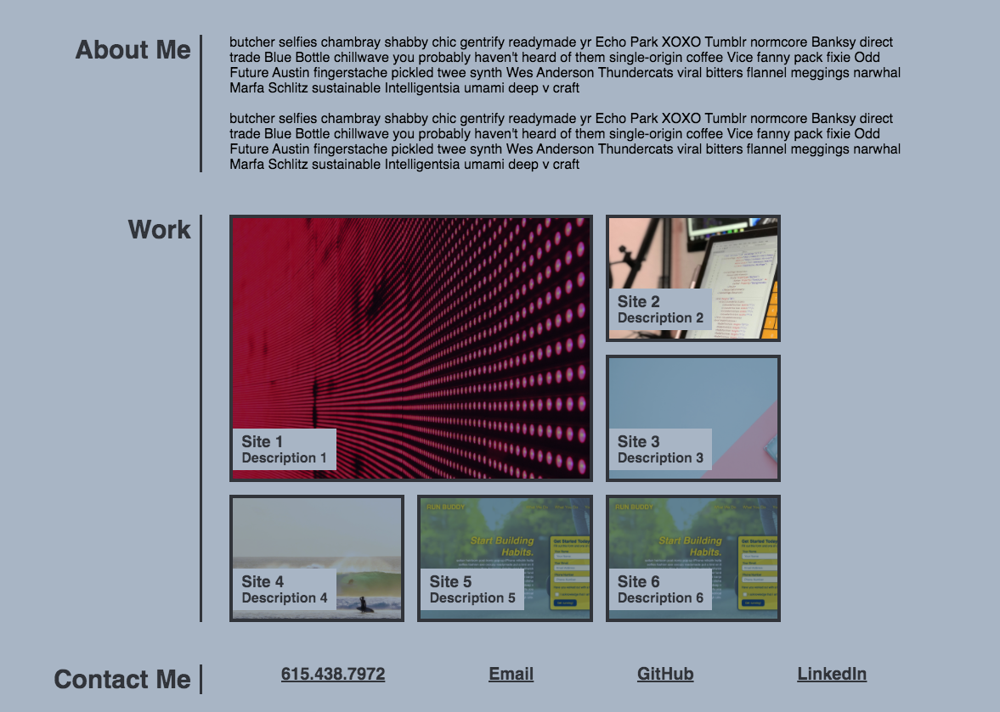

# Portfolio

## Purpose
A website that offers potential employers a chance to view my porfolio work.  Pertinent information includes:
* Link to resume
* Photo of myself
* About me bio section
* Six select portfolio sites with links
* Contact info in multiple forms with links

This is a basic landing page with a few links in the navigation bar to the three main sections below as well as a pdf resume.

## Built With
* HTML
* CSS

## Website
https://taylornyquist.github.io/portfolio/

## Screen Shots

 
  

 ## Responsiveness
* Media queries optimized for widths of 768px and 414px (iPad and iPhone plus respectively)
* Flex boxes used throughout
* CSS grid used for the six portfolio sites

### Contribution
Made with ❤️ by Taylor Nyquist